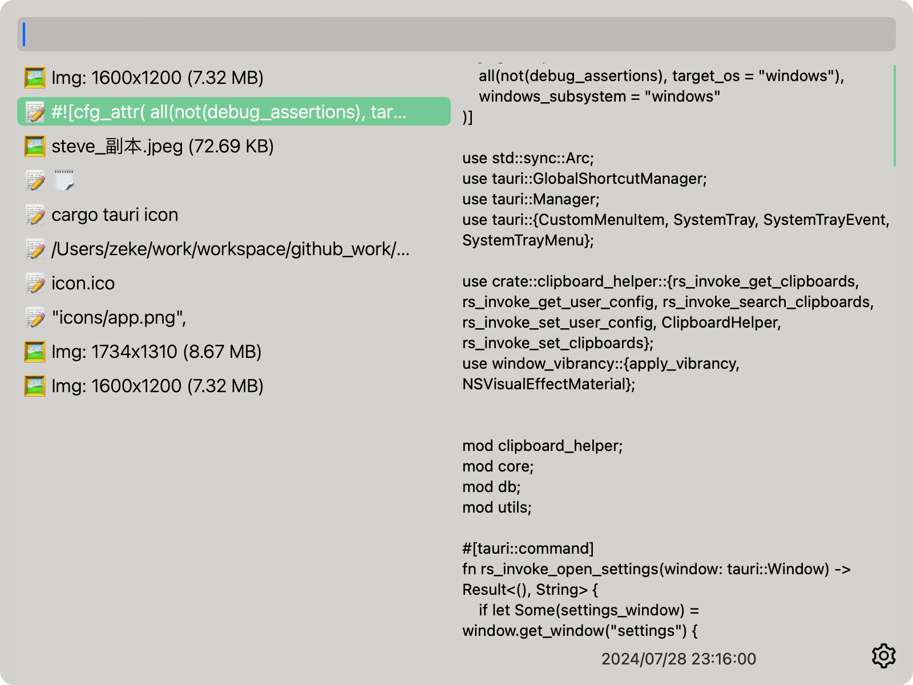
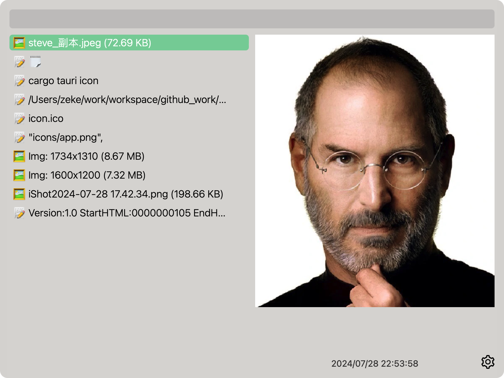
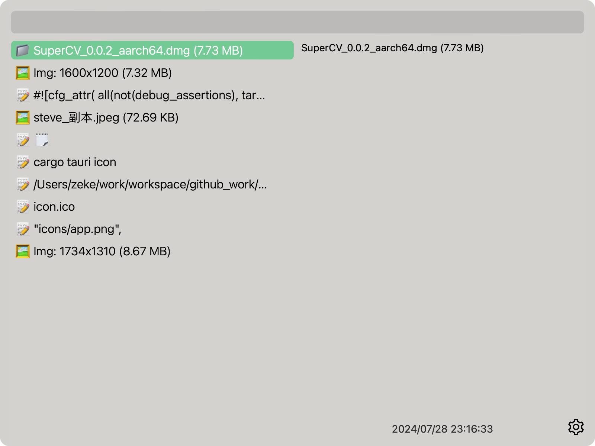

<h1 align="center">
  
   
  更适合CV工程师体质的
   
   
  剪切板增强工具📋
   
</h1>

[English](README_en.md)

## 介绍

SuperCV 利用 Tauri 和 Rust 构建，是一个剪切板增强工具。

支持文本、图片和文件的剪切板历史及搜索功能，支持局域网内多设备剪切板同步。
常见问题见 [FAQ](./docs/faq.md)

## 预览

**<u>使用 `CommandOrControl+Shift+L` 唤出 SuperCV 页面</u>**

|                文本                |               图片               |               文件                |
| :--------------------------------: | :------------------------------: | :-------------------------------: |
|  |  |  |

## 安装

请到发布页面下载对应的安装包：[Release Page](https://github.com/Zeke-chin/SuperCV/releases)

已验证支持桌面平台 Windows (x64), Linux_X11 (x64), MacOS (Intel/apple)

其他桌面平台 未测试

## 特性

- **轻量化** 使用 tauri 打包，底层使用零开销的 rust 提供良好性能
- 支持局域网多设备**共享剪切板**(待实现)
- 文本、图片、文件类型的剪切板的历史和搜索 🔍
- 分别对文本、图片、文件类型设置保留时间
- 支持设置预览条数

## TODO

- [x] 支持多文件
- [ ] 快捷键配置
- [ ] 服务端同步功能
- [ ] 支持查看更多剪切板内容
- [ ] ...

## 开发指南

1. 安装依赖
   - Rust: [install](https://www.rust-lang.org/tools/install) , version >= `1.63`
   - Node: [install](https://nodejs.org/en/download/package-manager), version >= `20.15`
   - (如果你是 Linux): `sudo apt-get update && sudo apt-get install -y libgtk-3-dev webkit2gtk-4.0 libappindicator3-dev librsvg2-dev patchelf`
2. clone 仓库

   - `git clone https://github.com/Zeke-chin/SuperCV `

   - `cd  SuperCV`

3. 安装前端依赖
   - `npm install` or `yarn`
4. 启动 dev
   - `npm run tauri dev`

<!DOCTYPE html>
<html lang="en">
<head>
    <meta charset="UTF-8">
    <meta name="viewport" content="width=device-width, initial-scale=1.0">
</head>
<body>
    <h2>开发者</h2>
    <ul class="developer-list">
        <li class="developer-item">
            
            <a href="https://github.com/zeke-chin" class="name">zeke-chin</a>
        </li>
        <li class="developer-item">
            
            <a href="https://github.com/langchou" class="name">langchou</a>
        </li>
        <li class="developer-item">
            
            <a href="https://github.com/N1body" class="name">N1body</a>
        </li>
    </ul>
</body>
</html>

## 感谢

- [ChurchTao/clipboard-rs](https://github.com/ChurchTao/clipboard-rs) :Cross-platform clipboard API (text | image | rich text | html | files | monitoring changes)
- [tauri-apps/tauri](https://github.com/tauri-apps/tauri): Build smaller, faster, and more secure desktop applications with a web frontend.
- [clash-verge-rev/clash-verge-rev](https://github.com/clash-verge-rev/clash-verge-rev): Continuation of Clash Verge - A Clash Meta GUI based on Tauri (Windows, MacOS, Linux)
